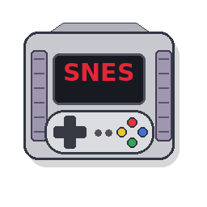
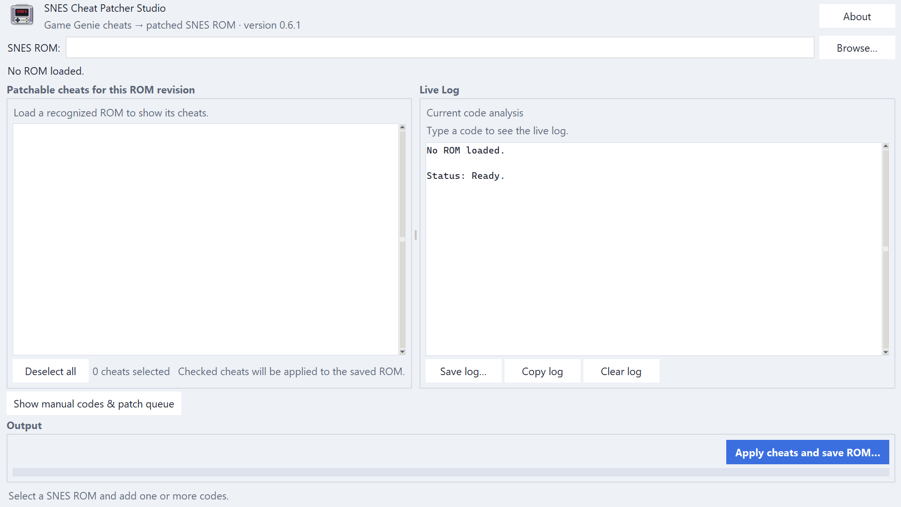

# SNES Cheat Patcher Studio

[](https://github.com/Dax-Dot/SNES-Cheat-Patcher-Studio/actions/workflows/ci.yml)
[](LICENSE)
[](https://www.python.org/)

<p align="center">
  
</p>

SNES Cheat Patcher Studio is a desktop application that permanently applies
supported Game Genie cheats to legally obtained SNES ROM backups.

Load a recognized `.sfc` or `.smc` ROM, choose the cheats you want, and save a
new patched copy. The original ROM is never modified.



## Download for Windows

Download the portable ZIP from the
[latest release](https://github.com/Dax-Dot/SNES-Cheat-Patcher-Studio/releases/latest):

1. Download `SNES-Cheat-Patcher-Studio-Windows-Portable.zip`.
2. Extract the entire ZIP.
3. Open the extracted folder.
4. Run `SNES-Cheat-Patcher-Studio.exe`.

Keep the executable and its `_internal` folder together. Windows may show a
SmartScreen warning for an unsigned community application; review the file and
choose **Run anyway** only when it was downloaded from this repository.

Linux and macOS users can run the application from source as described below.

## How to use

1. Select **Browse...** and open a legally obtained SNES ROM.
2. When the exact ROM revision is recognized, compatible cheats appear.
3. Check the cheats you want to apply.
4. If two cheats modify the same ROM location, choose which one to keep.
5. Select **Apply cheats and save ROM...**.
6. Save the patched ROM under a new name and test it in an emulator.

A checked cheat will be applied; an unchecked cheat will not. There is no
**Select all** option because many cheat lists contain mutually exclusive
values or alternate versions of the same effect.

## Main features

- Integrated catalog of statically patchable SNES Game Genie cheats.
- Exact ROM-revision identification using size and file hashes.
- Direct checkbox selection with automatic conflict detection.
- Manual Game Genie entry for advanced or modified-ROM workflows.
- Support for common SNES ROM layouts and copier headers.
- Automatic checksum repair in the saved ROM.
- Safe output creation without overwriting the original file.
- Native Tkinter interface for Windows, Linux, and macOS.

## Compatibility and limitations

The built-in catalog only appears when the loaded ROM exactly matches a known
revision. Translations, ROM hacks, bad dumps, interleaved images, and modified
ROMs normally have different hashes and may not match.

Only cheats that can be converted safely to fixed ROM offsets are offered.
Codes targeting RAM, SRAM, hardware registers, or dynamic coprocessor windows
cannot be permanently written into a ROM and are rejected.

The application verifies where a code will be written, but it cannot guarantee
that every third-party cheat description is correct or that every combination
will behave properly in gameplay. Keep backups and test patched ROMs carefully.

## Run from source

Requirements:

- Python 3.11 or newer.
- Tkinter / Tcl-Tk.
- No third-party runtime packages.

After extracting the source code, open a terminal in the project folder and run:

```bash
python3 run_gui.py
```

On Windows, use `python run_gui.py` or double-click `run_windows.bat`.

On Debian or Ubuntu, install Tkinter if needed:

```bash
sudo apt install python3-tk
```

For macOS, the official Python installer from
[python.org](https://www.python.org/downloads/macos/) includes a compatible
Tkinter build.

## Legal notice

This project does not include ROMs, BIOS files, save files, or copyrighted game
assets. Use it only with ROM backups you are legally permitted to modify.

The application is free software released under the
[GNU GPL v3 or later](LICENSE). Third-party data and project credits are listed
in [ATTRIBUTIONS.md](ATTRIBUTIONS.md).

Parts of the SNES Game Genie decoding logic were adapted from
[Mte90's Game-Genie-Good-Guy](https://github.com/Mte90/Game-Genie-Good-Guy/)
project. See [ATTRIBUTIONS.md](ATTRIBUTIONS.md) for details.

## Feedback and issues

Bug reports and suggestions are welcome in
[GitHub Issues](https://github.com/Dax-Dot/SNES-Cheat-Patcher-Studio/issues).
Please do not attach or link copyrighted ROM files.
